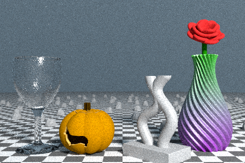

# polish

This is a simple deep learning system for denoising ray traced images.


The above image was rendered with 50 rays-per-pixel, and then denoised in RGB space with a deep neural network. For more, see [the example below](#example).

This repository includes:

 * A command-line utility for denoising images
 * A Go inference library with pre-trained models
 * A program to create a denoising dataset from scratch
 * A training pipeline in [PyTorch](https://pytorch.org/)

This package supports plain RGB images, as well as images with auxiliary feature channels (e.g. albedo maps).

# Usage

**Note:** this code expects a version of Go that supports modules. Ideally, version 1.14 or later. See the [Go downloads page](https://golang.org/dl/).

## Command-line interface

To build the command-line tool, simply clone this repository (outside of your `GOPATH`) and run:

```
$ go build -o polish_cli
```

Now you can run the `polish_cli` binary to denoise an image:

```
./polish_cli input.png output.png
```

## Go API

There is also a Go API for `polish`, implemented in the [polish](polish) sub-directory. The main API is `PolishImage`:

```go
func PolishImage(t ModelType, img image.Image) image.Image
```

For example, you could use the built-in deep CNN model as follows:

```go
output := polish.PolishImage(polish.ModelTypeDeep, input)
```

# Training your own models

The built-in pre-trained models should be sufficient for most use cases. However, if you do need to train your own model, this repository includes everything needed to create a dataset and train a model on it.

## Getting data

You will likely want to get started by downloading the ~2GB [data_1187.tar](https://polish.aqnichol.com/data_1187.tar) dataset, which includes 1187 rendered scenes.

The dataset was created with the [create_dataset](create_dataset) program, which creates random scenes and renders them at various rays-per-pixel. It expects to use models from [ModelNet40](https://modelnet.cs.princeton.edu/), and textures from ImageNet (or any directory of images, really). It generates scenes by selecting a layout type (either a boxed room or a large dome), randomizing lighting, loading and positioning various 3D models, and selecting random textures and materials for all models and walls.

## Training with PyTorch

The [training](training) directory contains a Python program to train a denoising neural network. It processes data produced by `create_dataset`, and automatically performs data augmentation and other tricks using that data. It includes a Jupyter notebook for converting the finished PyTorch models into Go source files that can be integrated into the Go package.

# Example

Here is a noisy rendering, produced from the [model3d](https://github.com/unixpickle/model3d) showcase with 50 rays-per-pixel:



This picture is pretty noisy, We can make it less noisy by using more rays. Here's a rendering with 10 times as many rays, which makes rendering take 10x as long:


Obviously, it'd be nice if we didn't need so much more compute to produce a clean image. Enter `polish`. We can simply denoise the noisy rendering like so:

```
$ polish example/50_rpp.png example/denoised_deep.png
```


This denoising took place using only RGB values from the original image. We could also use albedo maps and incidence angles, which are auxiliary channels looking like this:


The `polish` API can generate these images for a scene, and can denoise using these features. Here's how you can use the command-line tool to run a deep model with auxiliary input channels:

```
polish -model deep-aux -incidence example/incidence.png -albedo example/albedo.png example/50_rpp.png example/denoised_deep_aux.png
```


